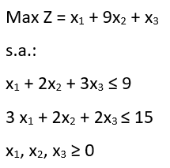

```{r setup, include=FALSE}
knitr::opts_chunk$set(message=FALSE,warning=FALSE, cache=TRUE, fig.asp=0.62,fig.keep = 'last')
```

Here I will post projects related to more advance uses of R, such as linear programming and machine learning. Again, this section is all in Portuguese for now, but it will be soon translated to English in its entirety.

# Linear Programming

Problemas de otimização que podem ser resolvidos por intermédio da programação linear (PL) também são manipuláveis e solucionáveis através do R. Há um pacote bastante proeminente que traz funções especialmente voltadas à solução de modelos lineares conhecido como `lpSolve`. Fácil de encontrar e de se instalar, este pacote está disponível no repositório CRAN:

```{r message=FALSE}
library(lpSolve)
```

```{r, echo=FALSE, message=FALSE}
relat.lprec = function(nameLprec){
  #armazenar as dimensões do problema
  dual_var = matrix(get.dual.solution(nameLprec), nrow = 1)
  a = ncol(nameLprec)
  b = ncol((dual_var))
#Vetor para criaçãodo nome das variáveis"
  name_row = c(1:ncol(nameLprec))
  for (i in 1:ncol(nameLprec)) 
  {name_row[i] = paste("X", i, sep = "")}
#Vetor para armazenar os valores das constantes da função objetivo
  contr_z = c(1:ncol(nameLprec))
  for (i in 1:ncol(nameLprec))    
  {contr_z[i] = get.mat(nameLprec, 0, i)}
  
#armazenar as variáveis dual, custos reduzidos e preços sombras
  red_cost = as.data.frame(dual_var[(b-a+1):b], ncol = 1)
  colnames(red_cost) = "Custo reduzido"
  shad_price = as.data.frame(dual_var[2:(b-a)], ncol=1)
  colnames(shad_price) = "Preço sombra"
  
#armazenar resultaddo
  result = cbind.data.frame(get.objective(nameLprec),matrix(get.variables(nameLprec), nrow = 1))
  dimnames(result) = list("Resultado", c("Z",name_row))
#criação da tabela de análise de otimalidade
  sensi_obj = as.data.frame(get.sensitivity.obj(nameLprec))
  colnames(sensi_obj)= c("Limite inferior", "Limite superior")
  coef_0bj = data.frame(contr_z, row.names = name_row)
  sensi_z = as.data.frame(cbind.data.frame(coef_0bj,red_cost, sensi_obj))
  colnames(sensi_z) = c("Coeficientes originais","Custo reduzido","Limite inferior", "Limite superior")
#criação da tabela de análise de viabilidade
  rhs = as.data.frame(get.constr.value(nameLprec))
  sensi_rhs = as.data.frame(get.sensitivity.rhs(nameLprec))
  lim_rhs = cbind.data.frame(sensi_rhs$dualsfrom[1:(b-a-1)], sensi_rhs$dualstill[1:(b-a-1)])
  sensi_rhs = cbind(rhs, shad_price, lim_rhs)
  colnames(sensi_rhs) = c("Valor original","Preço Sombra","Limite inferior", "Limite superior")
#correção dos limites de viabilidade
  rest.tipo = matrix(get.constr.type(nameLprec))
  n.asso =  get.constr.value(nameLprec)- get.constraints(nameLprec)
  for (i in 1:nrow(sensi_rhs)){
    if(sensi_rhs[i,2] == 0 ) {
      if (rest.tipo[i,1]== ">="){
        sensi_rhs[i,4] = get.constr.value(nameLprec)[i] - n.asso[i]
      }
      if (rest.tipo[i,1]== "<=") {
        sensi_rhs[i,3] = get.constr.value(nameLprec)[i] - n.asso[i]
      }
    }}
#apresentação dos resultados
  cat("
\n Valor das variáveis e função objetivo 
      \n")
  print(result)
  cat("
\n Análise de otimalidade 
      \n")
  print(sensi_z)
  cat("
\n Análise de viabilidade 
      \n")
  print(sensi_rhs)

}
```


O paradigma de programação funcional pode parecer desafiador num primeiro momento, especialmente por apresentar problemas matemáticos em uma forma diferente do que estamos acostumados a lidar cotidianamente. Contudo, no momento em que se compreende que funções são códigos especializados em lidar com dados de entradas, transformá-los e retornar uma informação na saída, a maior dificuldade foi ultrapassada. Não é diferente com PL e a biblioteca `lpSolve`.

Neste sentido, um problema de PL também não foge à essa realidade. Isto significa dizer que a representação formal matemática de um problema de PL comum será diferente de sua representação em R. Os coeficientes que multiplicam as variáveis serão dados como entrada em funções. Como exemplo disponível na própria documentação do CRAN:

<center>

</center>

## Formatação

Este problema deve ser inserido por etapas nas funções da biblioteca `lpSolve`. Antes de mais nada, é importante criar entidades em R que irão conter os elementos do exemplo:

```{r}
#vetor contendo os coeficientes da função objetivo
f.obj <- c(1,9,1)

#matriz 2x3 contendo as funções de restrição
f.con <- matrix(c(1,2,3,3,2,2),nrow=2,byrow=TRUE)

#vetor contendo o tipo de equação ou inequação das restrições
f.dir <- c("<=","<=")

#vetor contendo os lados direitos das restrições
f.rhs <- c(9,15)
```

Esta forma é bem comum, quando se lida com problemas resolvidos em linguagens de programação funcional. Com o R, não é diferente. Em vez de se inserir todo o problema de uma vez, armazena-se em entidades (vetores, data frames, matrizes, variáveis etc) partes componentes do problema de PL. Após essa etapa, é possível utilizar as funções do `lpSolve` para resolver o problema:

## Solução primal

```{r}
#função lp() com os parâmetros necessários para a solução do problema. "Solution" resolve
lp("max",f.obj,f.con,f.dir,f.rhs)$solution
```

O que significa dizer que a solução ótima para este problema requer `x1`=0, `x2`=4,5 e `x3`=0. Outras informações também são observáveis, acessando os componentes do `lp()`. Para a análise de sensibilidade, tanto em limites superiores e inferiores:

```{r}
#limites inferiores dos coeficientes (análise de sensibilidade)
lp ("max", f.obj, f.con, f.dir, f.rhs, compute.sens=TRUE)$sens.coef.from
```

Valores muito pequenos podem ser considerados como tendente a infinito negativo para efeitos práticos. Igualmente como expoentes `e00` iguala-se a 1. Portanto, `2+e00` significa 2. Ou seja, como resposta, essa função retorna a análise de sensibilidade inferior consecultivamente: tendendo a infinito negativo, 2 e tendente a infinito negativo.

```{r}
#limites superiores dos coeficientes (análise de sensibilidade)
lp ("max", f.obj, f.con, f.dir, f.rhs, compute.sens=TRUE)$sens.coef.to
```

Tal como no caso anterior, na prática esses resultados significam 4,5, tendendo a infinito positivo e 13,5.

## Dual

O `lp()` também disponibiliza informações acerca do dual. Contudo, os resultados tanto das restrições quanto das variáveis são devolvidos em um único vetor de resposta:

```{r}
lp ("max", f.obj, f.con, f.dir, f.rhs, compute.sens=TRUE)$duals
```

Os dois primeiros valores dizem respeito às restrições (4,5 e 0), enquanto que os três últimos dizem respeito às variáveis (-3,5, 0 e -10,5). Para encontrar os limitantes superiores e inferiores desses valores:

```{r}
#limites superiores
lp ("max", f.obj, f.con, f.dir, f.rhs, compute.sens=TRUE)$duals.from
```

```{r}
#limites inferiores
lp ("max", f.obj, f.con, f.dir, f.rhs, compute.sens=TRUE)$duals.to
```

## Visualização amigável

Entretanto, esta forma de visualização pode não ser muito amigável ao usuário. Pensando nisso, [Saulo Guilherme](https://github.com/Saulogr) criou uma função, `relat.lprec()`, para facilitar a visualização do relatório de resolução do problema de PL. Como argumento de entrada, a função utiliza o objeto gerado através da solução de PL disponível através do `make.lp()`. Utilizando a biblioteca `lpSolveAPI`:

```{r message=FALSE}
library(lpSolveAPI)
```


Contudo, tal como foi feito durante a etapa de formatação anterior, o objeto gerado para ser visualizado com a solução do problema de PL precisa ser formatado de maneira que a função `make.lp()` possa ser utilizada corretamente:

```{r results=FALSE}
#criando um modelo vazio com as dimensões das restrições (três variáveis)
lprec <- make.lp(0,3)

#definindo a maximização no lugar de minimização
lp.control(lprec,sense="max")

#função objetivo
set.objfn(lprec,c(1,9,1))

#restrições
add.constraint(lprec,c(1,2,3),"<=",9)
add.constraint(lprec,c(3,2,2),"<=",15)
```

Após a formatação, é possível visualizar o conteúdo do objeto `lprec`, que agora contém os dados do problema de PL:

```{r}
#visualizando a montagem do problema de LP
print(lprec)
```

A etapa de solução desta modalidade de resolução de problemas de PL é tão simples e direta quanto a modalidade anterior. Contudo, o intuito de demonstrar uma variante de solução diz respeito justamente à apresentação da função `relat.lprec()`:

```{r}
#resolvendo o modelo de PL (retorna 0, caso tudo esteja correto)
solve(lprec)

#chamando a função de apresentação
relat.lprec(lprec)
```

Esta maneira de apresentação é muito mais amigável ao usuário, por apresentar um relatório completo de fácil visualização. Ainda contém a correção de um erro na função nativa do `lpSolve` em um dos cálculos dos valores de preço sombra.