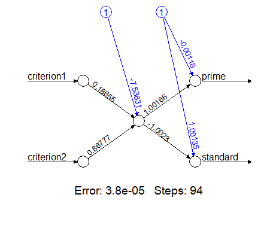

```{r setup, include=FALSE}
knitr::opts_chunk$set(message=FALSE,warning=FALSE, cache=TRUE, fig.asp=0.62,fig.keep = 'last')
```

Here I will post projects related to more advanced uses of R, such as linear programming and machine learning. Again, this section is all in Portuguese for now, but it will be soon translated to English in its entirety.

# Linear Programming

Problemas de otimização que podem ser resolvidos por intermédio da programação linear (PL) também são manipuláveis e solucionáveis através do R. Há um pacote bastante proeminente que traz funções especialmente voltadas à solução de modelos lineares conhecido como `lpSolve`. Fácil de encontrar e de se instalar, este pacote está disponível no repositório CRAN:

```{r message=FALSE}
library(lpSolve)
```

```{r, echo=FALSE, message=FALSE}
relat.lprec = function(nameLprec){
  #armazenar as dimensões do problema
  dual_var = matrix(get.dual.solution(nameLprec), nrow = 1)
  a = ncol(nameLprec)
  b = ncol((dual_var))
#Vetor para criaçãodo nome das variáveis"
  name_row = c(1:ncol(nameLprec))
  for (i in 1:ncol(nameLprec)) 
  {name_row[i] = paste("X", i, sep = "")}
#Vetor para armazenar os valores das constantes da função objetivo
  contr_z = c(1:ncol(nameLprec))
  for (i in 1:ncol(nameLprec))    
  {contr_z[i] = get.mat(nameLprec, 0, i)}
  
#armazenar as variáveis dual, custos reduzidos e preços sombras
  red_cost = as.data.frame(dual_var[(b-a+1):b], ncol = 1)
  colnames(red_cost) = "Custo reduzido"
  shad_price = as.data.frame(dual_var[2:(b-a)], ncol=1)
  colnames(shad_price) = "Preço sombra"
  
#armazenar resultaddo
  result = cbind.data.frame(get.objective(nameLprec),matrix(get.variables(nameLprec), nrow = 1))
  dimnames(result) = list("Resultado", c("Z",name_row))
#criação da tabela de análise de otimalidade
  sensi_obj = as.data.frame(get.sensitivity.obj(nameLprec))
  colnames(sensi_obj)= c("Limite inferior", "Limite superior")
  coef_0bj = data.frame(contr_z, row.names = name_row)
  sensi_z = as.data.frame(cbind.data.frame(coef_0bj,red_cost, sensi_obj))
  colnames(sensi_z) = c("Coeficientes originais","Custo reduzido","Limite inferior", "Limite superior")
#criação da tabela de análise de viabilidade
  rhs = as.data.frame(get.constr.value(nameLprec))
  sensi_rhs = as.data.frame(get.sensitivity.rhs(nameLprec))
  lim_rhs = cbind.data.frame(sensi_rhs$dualsfrom[1:(b-a-1)], sensi_rhs$dualstill[1:(b-a-1)])
  sensi_rhs = cbind(rhs, shad_price, lim_rhs)
  colnames(sensi_rhs) = c("Valor original","Preço Sombra","Limite inferior", "Limite superior")
#correção dos limites de viabilidade
  rest.tipo = matrix(get.constr.type(nameLprec))
  n.asso =  get.constr.value(nameLprec)- get.constraints(nameLprec)
  for (i in 1:nrow(sensi_rhs)){
    if(sensi_rhs[i,2] == 0 ) {
      if (rest.tipo[i,1]== ">="){
        sensi_rhs[i,4] = get.constr.value(nameLprec)[i] - n.asso[i]
      }
      if (rest.tipo[i,1]== "<=") {
        sensi_rhs[i,3] = get.constr.value(nameLprec)[i] - n.asso[i]
      }
    }}
#apresentação dos resultados
  cat("
\n Valor das variáveis e função objetivo 
      \n")
  print(result)
  cat("
\n Análise de otimalidade 
      \n")
  print(sensi_z)
  cat("
\n Análise de viabilidade 
      \n")
  print(sensi_rhs)

}
```


O paradigma de programação funcional pode parecer desafiador num primeiro momento, especialmente por apresentar problemas matemáticos em uma forma diferente do que estamos acostumados a lidar cotidianamente. Contudo, no momento em que se compreende que funções são códigos especializados em lidar com dados de entradas, transformá-los e retornar uma informação na saída, a maior dificuldade foi ultrapassada. Não é diferente com PL e a biblioteca `lpSolve`.

Neste sentido, um problema de PL também não foge à essa realidade. Isto significa dizer que a representação formal matemática de um problema de PL comum será diferente de sua representação em R. Os coeficientes que multiplicam as variáveis serão dados como entrada em funções. Como exemplo disponível na própria documentação do CRAN:

<center>

</center>

## Formatação

Este problema deve ser inserido por etapas nas funções da biblioteca `lpSolve`. Antes de mais nada, é importante criar entidades em R que irão conter os elementos do exemplo:

```{r}
#vetor contendo os coeficientes da função objetivo
f.obj <- c(1,9,1)

#matriz 2x3 contendo as funções de restrição
f.con <- matrix(c(1,2,3,3,2,2),nrow=2,byrow=TRUE)

#vetor contendo o tipo de equação ou inequação das restrições
f.dir <- c("<=","<=")

#vetor contendo os lados direitos das restrições
f.rhs <- c(9,15)
```

Esta forma é bem comum, quando se lida com problemas resolvidos em linguagens de programação funcional. Com o R, não é diferente. Em vez de se inserir todo o problema de uma vez, armazena-se em entidades (vetores, data frames, matrizes, variáveis etc) partes componentes do problema de PL. Após essa etapa, é possível utilizar as funções do `lpSolve` para resolver o problema:

## Solução primal

```{r}
#função lp() com os parâmetros necessários para a solução do problema. "Solution" resolve
lp("max",f.obj,f.con,f.dir,f.rhs)$solution
```

O que significa dizer que a solução ótima para este problema requer `x1`=0, `x2`=4,5 e `x3`=0. Outras informações também são observáveis, acessando os componentes do `lp()`. Para a análise de sensibilidade, tanto em limites superiores e inferiores:

```{r}
#limites inferiores dos coeficientes (análise de sensibilidade)
lp ("max", f.obj, f.con, f.dir, f.rhs, compute.sens=TRUE)$sens.coef.from
```

Valores muito pequenos podem ser considerados como tendente a infinito negativo para efeitos práticos. Igualmente como expoentes `e00` iguala-se a 1. Portanto, `2+e00` significa 2. Ou seja, como resposta, essa função retorna a análise de sensibilidade inferior consecultivamente: tendendo a infinito negativo, 2 e tendente a infinito negativo.

```{r}
#limites superiores dos coeficientes (análise de sensibilidade)
lp ("max", f.obj, f.con, f.dir, f.rhs, compute.sens=TRUE)$sens.coef.to
```

Tal como no caso anterior, na prática esses resultados significam 4,5, tendendo a infinito positivo e 13,5.

## Dual

O `lp()` também disponibiliza informações acerca do dual. Contudo, os resultados tanto das restrições quanto das variáveis são devolvidos em um único vetor de resposta:

```{r}
lp ("max", f.obj, f.con, f.dir, f.rhs, compute.sens=TRUE)$duals
```

Os dois primeiros valores dizem respeito às restrições (4,5 e 0), enquanto que os três últimos dizem respeito às variáveis (-3,5, 0 e -10,5). Para encontrar os limitantes superiores e inferiores desses valores:

```{r}
#limites superiores
lp ("max", f.obj, f.con, f.dir, f.rhs, compute.sens=TRUE)$duals.from
```

```{r}
#limites inferiores
lp ("max", f.obj, f.con, f.dir, f.rhs, compute.sens=TRUE)$duals.to
```

## Visualização amigável

Entretanto, esta forma de visualização pode não ser muito amigável ao usuário. Pensando nisso, [Saulo Guilherme](https://github.com/Saulogr) criou uma função, `relat.lprec()`, para facilitar a visualização do relatório de resolução do problema de PL. Como argumento de entrada, a função utiliza o objeto gerado através da solução de PL disponível através do `make.lp()`. Utilizando a biblioteca `lpSolveAPI`:

```{r message=FALSE}
library(lpSolveAPI)
```


Contudo, tal como foi feito durante a etapa de formatação anterior, o objeto gerado para ser visualizado com a solução do problema de PL precisa ser formatado de maneira que a função `make.lp()` possa ser utilizada corretamente:

```{r results=FALSE}
#criando um modelo vazio com as dimensões das restrições (três variáveis)
lprec <- make.lp(0,3)

#definindo a maximização no lugar de minimização
lp.control(lprec,sense="max")

#função objetivo
set.objfn(lprec,c(1,9,1))

#restrições
add.constraint(lprec,c(1,2,3),"<=",9)
add.constraint(lprec,c(3,2,2),"<=",15)
```

Após a formatação, é possível visualizar o conteúdo do objeto `lprec`, que agora contém os dados do problema de PL:

```{r}
#visualizando a montagem do problema de LP
print(lprec)
```

A etapa de solução desta modalidade de resolução de problemas de PL é tão simples e direta quanto a modalidade anterior. Contudo, o intuito de demonstrar uma variante de solução diz respeito justamente à apresentação da função `relat.lprec()`:

```{r}
#resolvendo o modelo de PL (retorna 0, caso tudo esteja correto)
solve(lprec)

#chamando a função de apresentação
relat.lprec(lprec)
```

Esta maneira de apresentação é muito mais amigável ao usuário, por apresentar um relatório completo de fácil visualização. Ainda contém a correção de um erro na função nativa do `lpSolve` em um dos cálculos dos valores de preço sombra.

# Perceptron simples: aplicação

## Problema proposto

Esta seção propõe-se a exibir um pequeno modelo de aprendizado de máquina (Perceptron simples) construido para ser aplicado na classificação binária de itens em estoque. A empresa em questão é fictícia e comporta, em seu estoque de matéria-prima, alguns itens que tem custo de aquisição de pallets com valores variados, bem como giro de utilização dos itens. Em resumo, os itens com maior valor de aquisição e alto giro de estoque serão classificados como "prime", ao passo que os componentes mais baratos e com menos utilização são classificados como "standard".

Esta distinção faz alusão à classificação de acordo com a curva ABC, ou curva de Pareto, que classifica itens de acordo com seu grau de importância, levando em consideração seu valor. Contudo, o modelo proposto difere da curva ABC por levar em consideração mais do que um critério (custo e giro de estoque), bem como classificar os itens de maneira dicotômica, não em A, B e C.

Também é importante notar que a distinção dos itens em classificações diferentes auxiliam na política de gestão de estoques item a item, bem como no posicionamento físico dos componentes dentro do galpão de estoque. Por exemplo, itens classificados como "prime" provavelmente deveriam ser posicionados próximos à entrada/saída do prédio, uma vez que isso evita o deslocamento até os fundos do galpão, por parte do funcionário responsável por entregar a matéria-prima à produção. Consequentemente, itens mais baratos e menos utilizados tem uma importância menor para a produção e podem ser alocados mais distantes da porta.

Neste caso, a empresa fictícia em questão tem dados históricos de **250 itens diferentes** e informações cedidas por especialistas sobre o grau de importância de cada um destes componentes. No geral, itens prime costumam ter como característica um *custo por pallet* que vai de **\$650** até **\$1000**, enquanto que os itens standard vão de **\$100** até no máximo **\$600** por pallet. Em relação ao *giro de estoque*, itens prime costumam ser utilizados a uma taxa que vai de **23 pallets/trimestre** até **35 pallets/trimestre**, enquanto que itens standards são utilizados a uma taxa de **4 pallets/trimestre** e no máximo **22 pallets/trimestre**.

**A empresa gostaria de poder classificar, sem pedir ajuda aos especialistas, novas matérias-primas que serão integradas à produção.**

## Perceptron simples

O algoritmo para o sistema proposto utiliza a abordagem de inteligência artificial, que visa resolver problemas reais por intermédio de computação e matemática valendo-se de mecanismos que simulem a cognição humana. Dentre as possíveis abordagens de inteligência artificial, uma das mais utilizadas é a de aprendizado de máquina, ou machine learning (ML). Algoritmos de ML tem como característica principal a utilização de conjuntos de dados previamente coletados para alimentar um sistema inteligente, que aprenderá a exercer sua tarefa de forma sensata (seja uma classificação, seja uma ordenação, ou mesmo uma escolha). A problemática em foco é a de classificação de itens em estoque, portanto sendo necessário a utilização de um algoritmo de ML que possa executar tal tarefa.

Dentre os algoritmos de ML para classificação mais utilizados , tanto na literatura específica quanto no mercado de trabalho, encontra-se a abordagem de redes neurais artificiais (RNA). Uma RNA emula o funcionamento de um cérebro humano, focando seu processamento computacional num neurônio que recebe sinais e os transfere para o próximo neurônio. O primeiro RNA desenvolvido era composto de uma única célula, e ficou conhecido como *Perceptron simples*. O esquema a seguir explica a estrutura esquemática de um Perceptron simples típico:

<center>

</center>

Os nós brancos à esquerda e à direita são, respectivamente, as entradas e saídas do neurônio, que é representado pelo nó branco ao centro da figura. Tanto *criterion1* quanto *criterion2* representam as informações de entrada do neurônio, ao passo que *prime* e *standard* representam as possibilidades de resposta do neurônio, a depender do que foi alimentado na entrada. Os círculos azuis são responsávels por trazer informações sobre o *bias*, ruído inevitável em todo sistema, ao passo que os valores sobre as linhas de ligação representam os pesos que cada conexão tem no sistema.

Estas conexões possibilitam a passagem da informação de entrada para o neurônio, e finalmente para a saída. Este processo acontece através da normalização matemática dos valores de entrada, multiplicação destes valores pelos pesos de conexão e operação (muitas vezes uma soma) no neurônio, obedecendo a uma regra pré-estabelecida conhecida como *função de ativação*. Consequentemente, esta função não apenas unifica os dados normalizados e ponderados vindos das entradas, mas também comparam o resultado final com um limiar. Esta comparação, por fim, determina o grau de probabilidade ou para qual rota de sáida a informação irá ser encaminhada.

Como mencionado anteriormente, o RNA é um algoritmo de ML, e consequentemente precisa aprender a ser sensato com os dados previamente alimentados nele. Isso significa que os pesos iniciais, no início do ajuste dos pesos (conhecido como *treino*) devem ser ajustados de acordo com uma função de erro. Existem diversas abordagens na literatura que descrevem vantagens e desvantagens da adoção de certas funções de erro particulares, mas é suficiente saber que os dados são alimentados no sistema, o sistema produz uma saída, e essa saída é comparada com o resultado desejado. Se a diferença for maior do que o esperado, a função erro reajusta os pesos e reinicia o processo, até se esgotar a quantidade de dados disponiveis para treino, ou o algoritmo conseguir convergir para um grau de erro aceitável.

Por fim, após a etapa de treino, a etapa de *teste* serve para informar ao programador da RNA o grau de eficiência do algoritmo. Esta etapa consiste em inserir no RNA já treinado alguns outros dados históricos não utilizados durante a etapa de treino para saber qual o percentual de acerto da RNA. Após a obtenção dessa informação, a RNA estará validada (ou não) para ser utilizada para classificar novos dados.

## Modelagem do algoritmo

Embora existam já diversas funções e bibliotecas próprias para a utilização de RNA, este projeto dedicou-se a modelar as particularidades de um Perceptron simples em todos os seus passos. Este trabalho é baseado no projeto de [Sadawi (2014)](https://github.com/nsadawi/perceptron), mas possui particularidades não encontradas no material original.

Inicialmente, criaremos a função de ativação, que retornará 0, caso os dados fornecidos fiquem abaixo de um determinado limiar `theta` e 1 se ficar acima:

```{r}
activationFunction <- function (theta, weight, cost, turnOver){
  sumCells <- cost*weight[1] + turnOver*weight[2] + weight[3]
  
  if (sumCells>= theta){return(1)}
  else {return(0)}
}
```

As outras variáveis passadas como parâmetro da função `activationFunction()` são `weight`, `cost` e `turnOver`. A variável `weight` é responsável por trazer o vetor contendo os pesos na iteração atual, enquanto que `cost` representa o custo de aquisição do pallet das matérias-primas e `turnOver` informa o giro de estoque do item em questão.

A seguir, cria-se a função `perceptron()`:

```{r}
perceptron <- function(maxIter, learningRate, numInstances, theta){
  
# Como pode ser visto nos argumentos da função, maxIter diz respeito ao número máximo de tentativas (ou seja, iterações) que o algoritmo pode tentar, antes de declarar uma mensagem de que não convergiu para o usuário. Este cenário é possível, quando se trata de um dataset contendo elementos difíceis ou impossíveis de serem separados em classes diferentes, pelo algoritmo. A variável learningRate é responsável por informar a taxa percentual de mudança dos pesos a cada iteração, enquanto que numInstances contém informações sobre a quantidade de dados disponíveis para as etapas de treino e teste. Por fim, esta função também faz uso do parâmetro theta
  
#--------------------------------------
  
#No mundo real, dados a respeito das matérias-primas estariam armazenados em bancos de dados, como MySQL, MS Access, Excel etc. Para este exemplo, utilizaremos dados gerados in silico, ou seja, aleatoriamente, porém simulando serem dados reais. Serão necessários 4 vetores: 2 para treino e 2 para teste, e 2 para cada atributo (no caso, custo e giro de estoque). as dimensões do vetor de treino será fornecida na execução do algoritmo, enquanto que o vetor de teste foi escolhido como sendo de 100 itens diferentes
  
  costTraining <- vector(length = numInstances)
  costTest <- vector(length = 100)
  
  turnOverTraining <- vector(length = numInstances)
  turnOverTest <- vector(length = 100)
  
#--------------------------------------
  
#Juntamente com os vetores contendo os valores das características de treino e teste, também é necessário que existam vetores contendo as classificações como "prime" (0) e "standard" (1), com as mesmas dimensões dos vetores de treino e teste
  
  classificationTraining <- vector(length = numInstances)
  classificationTest <- vector(length = 100)
  
#--------------------------------------
  
#Um outro vetor necessário armazenará os valores da etapa de teste
  
  testOutput <- vector(length = 100)
  
#--------------------------------------
  
#Já o vetor para guardar os pesos das conexões das entradas com o neurônio também tem que contemplar o bias como um peso gerado aleatoriamente
  
  weight <- vector(length = 3)
  
  weight[1]<-runif(1,min=0,max=1) #w1
  weight[2]<-runif(1,min=0,max=1) #w2
  weight[3]<-runif(1,min=0,max=1) #bias
  
#--------------------------------------
  
#As variáveis de erro, necessárias nas etapas intermediárias, bem como as de contagem de iteração e de eficiência devem ser declaradas com seus respectivos valores iniciais para a primeira iteração
  
  localError <- NA
  globalError <- NA
  right <- 0
  wrong <- 0
  
  iteration <- 1
  
#--------------------------------------
  
#Após a criação dos vetores que irão conter os dados de treino, é preciso que se preencham os valores adequados. Para a primeira metade dos componentes gerados in silico, forçaremos que eles sejam classificados como "prime", e exatamente por essa razão, é necessário que seus valores nos atributos correspondam à descrição dada pela empresa, em relação ao custo do pallet e ao giro de estoque. O mesmo também acontece para os produtos "standard", apenas que a classificação será 1 para todos os itens que compõem a segunda metade do vetor que guarda as informações
  
  for (i in 1:(numInstances/2)){
    costTraining[i] <- runif(1, min=650, max=1000)
    turnOverTraining[i] <- runif(1, min=23, max=35)
    classificationTraining[i] <- 0
  }
  
  for (i in (1+numInstances/2):numInstances){
    costTraining[i] <- runif(1, min=100, max=600)
    turnOverTraining[i] <- runif(1, min=4, max=22)
    classificationTraining[i] <- 1
  }
  
#--------------------------------------
  
#A etapa de normalização dos vetores ocorre com uma simples conversão de valores, uma vez que os atributos apresentam-se em grandezas muito diversas. Este sistema normaliza os dados ao limitá-los proporcionalmente no intervalo continuo entre -1 e 1.

  for (i in 1:numInstances){
    costTraining[i]<-((1000/2)-costTraining[i])/(1000/2)
    turnOverTraining[i]<-((35/2)-turnOverTraining[i])/(35/2)
  }
  
#--------------------------------------
  
#As iterações de fato ocorrem seguindo passos imperativos: primeiramente, o erro global é setado como valendo 0. A finalização desse laço representa o fim da etapa de treinos, e o algoritmo pode então passar para a etapa de testes, com os 100 pontos restantes
  
  repeat{
    globalError<-0
    
    for (p in 1:(numInstances)){
      #armazenando na variável output, para cada iteração, o valor obtido com a função de ativação
      output <- activationFunction (theta,weight,costTraining[p],
                                    turnOverTraining[p])
      
      #cálculo do erro local: a diferença entre a classificação real e o que foi obtido através da função de ativação
      localError<-classificationTraining[p]-output
      
      #atualizando os valores dos pesos a partir do erro da iteração para cada atributo
      weight[1]<-weight[1]+learningRate*localError*costTraining[p]
      weight[2]<-weight[2]+learningRate*localError*turnOverTraining[p]
      weight[3]<-weight[3]+learningRate*localError 
      
      #calculando o erro acumulado global
      globalError<-globalError+localError*localError
    }
    #avançando um passo na iteração
    iteration <- iteration+1
    
    #A função só continua quando o erro global for 0 mais uma vez ou exceder o máximo de iterações
    if(globalError==0 | iteration>maxIter){break()}
  }
  
#--------------------------------------
  
#Como dito anteriormente, serão gerados também in silico os 100 itens de matéria-prima que dizem respeito à etapa de teste. Tal como na etapa de treino, os valores corresponderão às descrições dadas pela empresa (que, numa situação real, não precisariam ser gerados in silico, apenas capturados do banco de dados e tratados para o uso no R). Os 50 primeiros valores correspondem a componentes "prime" e os outros 50 aos componentes "standard"
  
  for (i in 1:50){
    costTest[i] <- runif(1, min=350, max=1000)
    turnOverTest[i] <- runif(1, min=18, max=35)
    classificationTest[i] <- 0
  }
  
  for (i in 51:100){
    costTest[i] <- runif(1, min=100, max=600)
    turnOverTest[i] <- runif(1, min=4, max=22)
    classificationTest[i] <- 1
  }
  
  #normalizando também esses vetores
  for (i in 1:max(length(costTest), length(turnOverTest))){
    costTest[i]<-((1000/2)-costTest[i])/(1000/2)
    turnOverTest[i]<-((35/2)-turnOverTest[i])/(35/2)
  }
  
#--------------------------------------
  
#Os 100 itens de teste agora já estão normalizados e serão classificados pela RNA já treinada. Isso acontecerá dentro de um laço de repetição que utilizará a função de ativação, agora com os valores de teste. Após a obtenção dos valores a cada iteração, os pontos serão coloridos de acordo com o grau de acerto da rede: pontos corretamente classificados serão representados em azul no gráfico, enquanto que pontos erroneamente classificados serão classificados em vermelho
  
  for (i in 1:100){
    
    testOutput[i]<- activationFunction (theta, weight, costTest[i], turnOverTest[i])

    if(testOutput[i]==classificationTest[i]){
      classificationTest[i] <- "blue"
      right <- right + 1;
    }
    else{classificationTest[i]<-"red"}
    wrong <- wrong + 1;
  }

#--------------------------------------  

#Para uma melhor compreensão gráfica, faz-se necessário a definição da reta que divide o gráfico onde os pontos correspondentes aos itens de teste serão representados. Os coeficientes da reta podem ser obtidos através de relações entre os pesos, uma vez que o Perceptron simples consiste especificamente em encontrar uma reta que consiga dividir (classificar) o gráfico em duas partes distintas
  
  a <- (-weight[3]/weight[2])
  b <- (-weight[1]/weight[2])
  
#--------------------------------------
  
#Além da representação gráfica, informações sobre as iterações, o erro global e a eficiência da RNA também podem ser impressas no console do R

  print (paste("Iterações:",iteration-1))
  
  #prints global error
  print (paste("Erro global:",globalError))
  
  #efficiency
  print (paste("Classificações erradas:",100-right))
  print (paste("Classificações corretas:",right))
  
#--------------------------------------
  
#O gráfico conterá, na parte superior, a equação da reta, bem como um plot de pontos azuis e vermelhos, dependendo da quantidade de itens classificados corretamente ou erradamente pela RNA
  
  plot(costTest, turnOverTest,xlim=c(-1,1),ylim=c(-1,1), col=classificationTest,
       type="p", main=paste("RETA: (", signif(weight[1],digits = 2),"* X1 ) + (",
                            signif(weight[2],digits = 2),"* X2 ) + ",
                            signif(weight[3],digits = 2),"= 0"), cex = .8, 
       , pch = 16, lwd = .1 )
  abline(a,b)
}
```

Após a preparação da função `perceptron()`, resta utilizá-la com os parâmetros adequados. Neste caso, utilizaremos os 150 itens restantes para treino (lembrando que os 100 primeiros foram utilizados na fase de teste, já construídos no corpo da função), bem como 10000 iterações limite, taxa de aprendizado de 10% e limiar 0 na função de ativação:

```{r}
perceptron (10000,0.1,150,0)
```

Enfim, se o decisor julgar que a rede está bem treinada, poderá utilizá-la para classificar novos itens que nunca antes foram classificados por nenhum especialista. O RNA torna-se, portanto, especialista em classificar componentes como "prime" ou "standard".